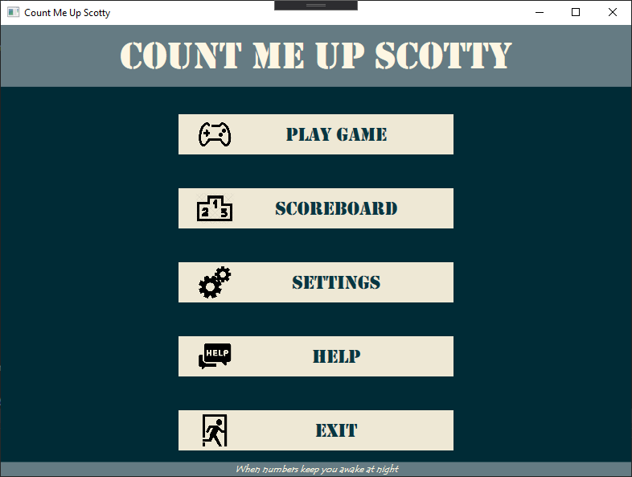
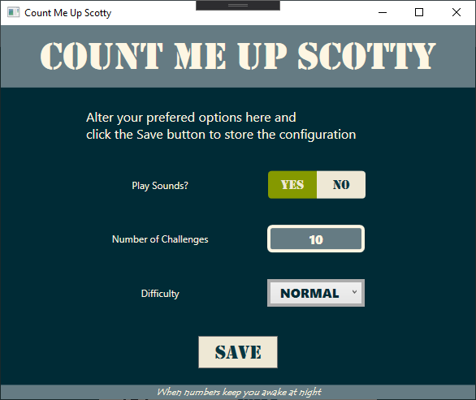
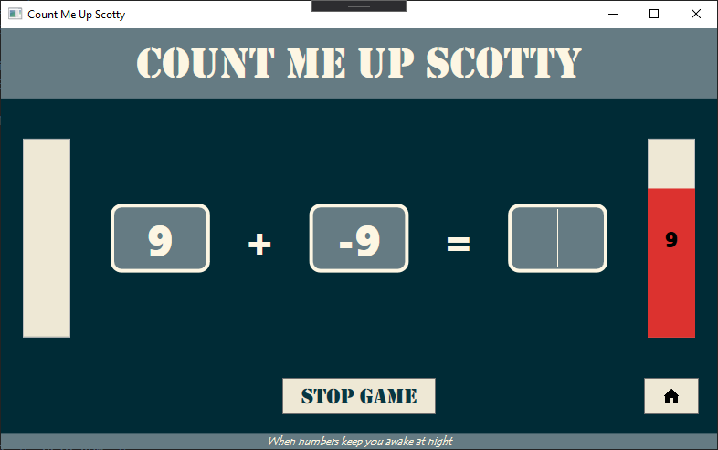
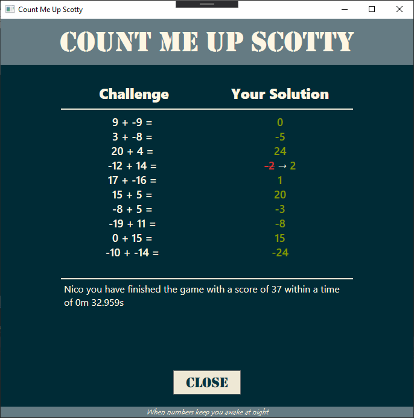

# Count Me Up Scotty

Count Me Up Scotty is a game for younger children to sharpen their math skills. It challenges kids to solve additions, multiplications, ... as quick and correctly as possible.

By tracking their time and keeping score they are challenged to beat their own records of that of their friends.

The students started their journey towards a graphical WPF app based on the console application which can be found at [https://github.com/BioBoost/count-me-up-scotty-terminal-edition](https://github.com/BioBoost/count-me-up-scotty-terminal-edition).

## The Assignment

The assignment was to create a login window allowing the player to identify him/herself. Once logged in, the player should then be able to play a couple of challenges.

Other things to include

* difficulty level
* a scoreboard
* add timing
* display progress
* report solutions after a challenge session

## Some Images

### Nice Main Menu

### Settings

### Math Challenges

### Result Overview

